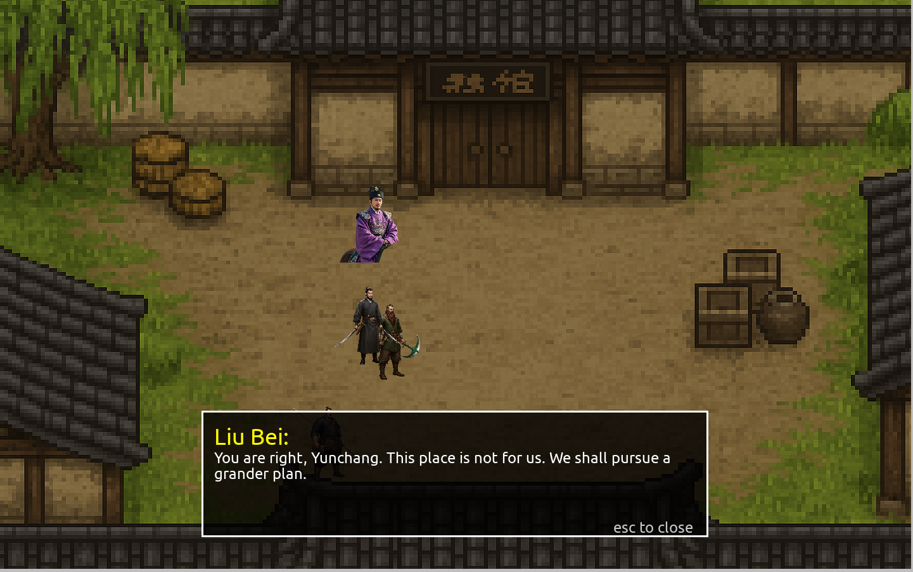

# Dream Farming - AI-Powered Game Asset Generator

This project uses AI to automatically generate game assets (characters, world maps) from story descriptions and creates an interactive game experience.

## Overview

Dream Farming transforms written stories into visual game assets using multiple AI services:
- **Google Gemini**: Extracts character and location information from stories
- **Imagen-3.0**: Generates character images
- **DALL-E**: Creates world maps
- **Recraft**: Removes backgrounds from character images

## Prerequisites

- Python 3.8+
- pip package manager
- API keys for Google Gemini, OpenAI, and Recraft

## Installation

1. Clone the repository:
```bash
git clone <repository-url>
cd "Dream Farming"
```

2. Install required dependencies:
```bash
pip install google-generativeai openai pillow requests pyyaml pygame
```

## Usage Instructions

### Step 1: Write Your Story

Create a story file named `story.txt` in the root directory. Write your story including:
- Character descriptions (appearance, personality, role)
- Location descriptions (environment, atmosphere)
- Plot elements and dialogue

Example:
```
In the mystical land of Eldoria, a young mage named Luna with silver hair and blue robes...
The ancient forest of Whisperwind is filled with glowing mushrooms and crystal streams...
```

### Step 2: Configure API Keys

Edit the configuration file `code/config.yaml` and add your API keys:

```yaml
# API Keys Configuration
# Google Gemini API key for image generation and text processing
gemini_api_key: "your_gemini_api_key_here"

# OpenAI API key for DALL-E image generation
openai_api_key: "your_openai_api_key_here"

# Recraft API key for background removal
recraft_api_key: "your_recraft_api_key_here"
```

**How to get API keys:**
- **Google Gemini**: Visit [Google AI Studio](https://aistudio.google.com/) and create an API key
- **OpenAI**: Sign up at [OpenAI Platform](https://platform.openai.com/) and generate an API key
- **Recraft**: Register at [Recraft AI](https://www.recraft.ai/) and obtain an API key

### Step 3: Generate Game Assets

Run the AI asset generator:

```bash
cd code
python llm.py
```

This will:
1. Extract character and location information from your story
2. Generate character images using Imagen-3.0
3. Remove backgrounds from character images
4. Create a world map using DALL-E
5. Save all assets in the `graphics/` directory
6. Output extracted information to `output.json`

**Generated Assets:**
- `graphics/character/[character_name].png` - Character images with backgrounds
- `graphics/character/[character_name]_vector.png` - Character images without backgrounds
- `graphics/world/world_map.png` - Generated world map
- `output.json` - Extracted story information

### Step 4: Run the Game

Launch the interactive game:

```bash
python main.py
```

The game will load your generated assets and create an interactive experience based on your story.

## Project Structure

```
Dream Farming/
├── code/
│   ├── llm.py              # AI asset generator
│   ├── config.yaml         # API configuration
│   └── prompt_hub.py       # AI prompts
├── graphics/
│   ├── character/          # Generated character images
│   └── world/             # Generated world maps
├── story.txt              # Your input story
├── output.json           # Extracted story data
├── main.py               # Game launcher
└── readme.me            # This file
```

## Features

- **Story Analysis**: Automatically extracts characters, locations, and plot elements
- **Character Generation**: Creates unique character images based on descriptions
- **World Building**: Generates atmospheric world maps
- **Background Removal**: Creates clean character sprites for games
- **Interactive Game**: Playable experience using generated assets

## Troubleshooting

**Common Issues:**

1. **"Config file not found"**: Ensure `config.yaml` is in the `code/` directory
2. **"API key not found"**: Check that your API keys are correctly set in `config.yaml`
3. **Image generation fails**: Verify your API keys have sufficient credits/quota
4. **Import errors**: Install missing packages with `pip install <package-name>`

**API Rate Limits:**
- If you encounter rate limit errors, wait a few minutes before retrying
- Consider upgrading your API plans for higher limits

## Example Output

After running the complete pipeline, you'll have:
- Character sprites ready for game development
- A custom world map matching your story's setting
- JSON data structure with all extracted story elements
- An interactive game showcasing your generated content



## License

This project is open source. Please ensure you comply with the terms of service for all AI APIs used.

## Contributing

Feel free to submit issues and enhancement requests!
